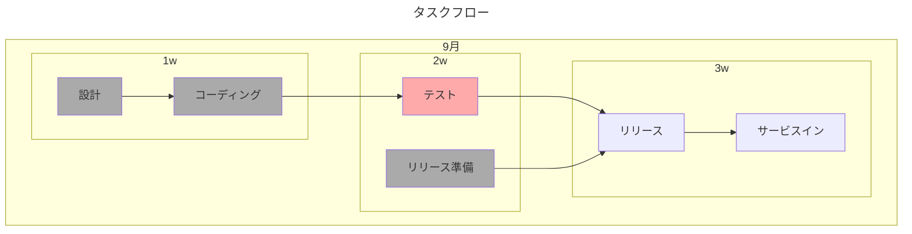

```mermaid

---
title: タスクフロー
---


%% graph LR
graph TB
T0[設計]
T1[コーディング]
T2[テスト]
T3[リリース準備]
T4[リリース]
T5[サービスイン]

T0 --> T1
T1 --> T2
T2 --> T4
T3 --> T4
T4 --> T5

subgraph 9月
  subgraph 1w
    T0
    T1
  end
  subgraph 2w
    T2
    T3
  end
  subgraph 3w
    T4
    T5
  end
end

%%色の指定
classDef done fill:#aaa;
classDef naosim fill:#faa;
class T0,T1,T3 done;
class T2 naosim;
```